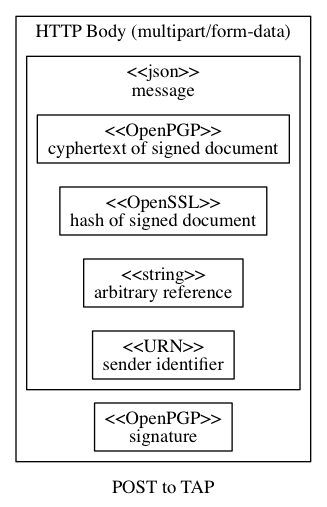

# Introduction

The Transaction Access Point (TAP) is a persistently connected "peer" capable of sending and
receiving business documents, such as invoices. It interacts with other TAPs following the
protocol specified in this document. The TAP is an autonomous agent in business-to-business
document exchange.

A TAP might be provided by a commercial ledger service, or maintained as part of an
independent business system. 

The TAP specification has two parts. The main part (TAP) defines the protocol all peers
must follow (and interfaces they must provide) to send and receive business documents. The
second part is an optional gateway specification (TAPGW), which defines a client-server
protocol for trusted business system components (e.g. ledger services) to interact with independent TAP service providers in a generic way.

## Dependencies

The messages send between TAPs carry payloads that encode
[billing-semantics](https://billing-semantics.readthedocs.io/).
This specification is maintained independently in the
[https://github.com/ausdigital/billing-semantics](https://github.com/ausdigital/billing-semantics)
repository. Future semantic payloads may be supported without change to the protocol.

All TAPs depend on the following Services:

 * [Capability locator (DCL)](http://capability-locator.readthedocs.io/)
 * [Metadata publisher (SMP)](http://metadata-publisher.readthedocs.io/)
 * [Notary (NTY)](http://notary.readthedocs.io)

TAPGW providers also depend on the
[Identity Provider (IDP)](http://identity-provider.readthedocs.io/). TAPs do not need to
authenticate when they interact with each other, due to use of well known cryprograpic keys
and service endpoint addresses.

## TAP Protocol Overview

In this protocol, a Transaction Access Point (TAP) is a business system component that sends and recieves business messages. The TAP Protocol describes how one TAP sends the message, and how the other TAP responds when a message is received.

The message is sent to the recieving TAP using HTTP POST operation, with a `Content-Type: multipart/form-data` body. This body contains two parts, `message` and `signature`.

The `message` part is a mixture of cleartext metadata (used by TAPs) and encyphered payload (used by trusted business system components). The cleartext metadata does not contain sensitive business information, wheras access to the business-sensitive information within the payload is not necessary for participating in the TAP protocol.

The `signature` part is created by a business system component trusted by the sender (with access to the sender's private key material). The signature can be used as a unique identifier of the message contents (e.g. transmitted document id).

Receiving TAPs may also use the signature as a filter (messages with invalid signatures MAY be dropped by recieving TAPs, rather than delivered). This allows TAPs to buffer trusted components from anonymous denial of service attacks.

When a valid message is received, the TAP issues an HTTP 200 status and returns a response body with `Content-Type: text/json`, containing a HATEOS-style list of callback URLs.

See the TAP Protocol Details chapter for more information.

## TAP Gateway (TAPGW) Protocol Overview

If a trusted business system is persistently connected to the internet and natively supports the TAP protocol, then it has no need for TAPGW interface, either as a client or server. Gateways are not necessary in the TAP protocol, the TAPGW sub-protocol is described as an optional extension to the TAP protocol.

There are various reasons why a business system architect may want a structural separation between their trusted components (e.g. ledger service, ERP system, etc) and their externaly facing components, such as a TAP Gateway. These include performance, reliability and security objectives, as well as a desire to focus on features that differentiate their system while outsourcing generic functionality to services with low-cost utility characteristics. The TAPGW sub-protocol is designed to ensure Gateway services are generic and interchangable commodities.

A TAP Gateway service is an avaialbility mediator (allowing trusted business system components to have intermittent connectivity, and/or to sit behind a firewall). It is however more than a simple asynchronous proxy (store-and-forward service); aditionally, it performs functions such as message validation, logging, access control, and protocol callbacks (including to Notary services).

Cryptography is used to prevent TAP Gateways from being able to inspect or manipulate the content of business messages. A TAP Gateway is not custodian of any business key material, it is only trusted to reliably send and receive messages. Message signing and encryption/decryption is performed by systems behind TAPs. The TAP is unable to verify signatures that have been encrypted, but can verify signatures that are not encrypted.

Notarisation to the blockchain makes it possible for the business system to audit the reliability of any TAP Gateway that it uses.

See the TAP Gateway Protocol Details chapter for more information.
